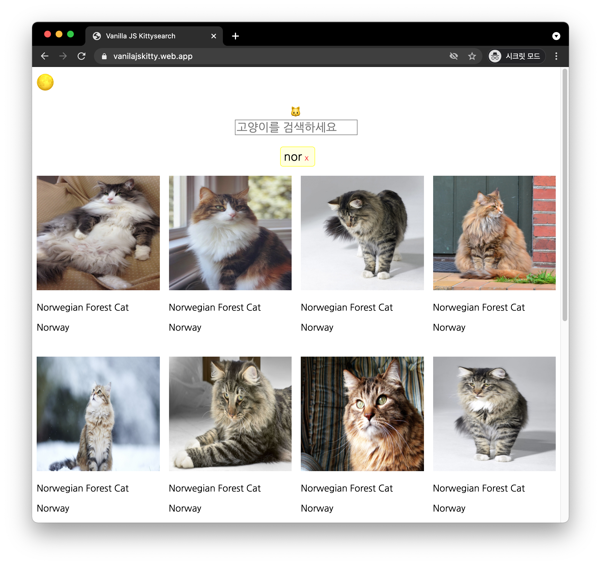

<h1 align="center">vanillaJSKitty 🐱</h1>
<p align="center">프로그래머스 2020 Dev-Matching: 웹 프론트엔드 개발자 (상반기) 과제<br/> Vanilla JS 고양이 사진 검색기</p>
<p align="center"><a href="https://vanilajskitty.web.app">데모 페이지</a></p>



이 레포는 **[프로그래머스 2020 Dev-Matching: 웹 프론트엔드 개발자 (상반기)](https://programmers.co.kr/competitions/131/2020-web-fe-first)** 과제를 복기한 결과물입니다.

라이브러리/프레임워크 없이 Vanilla JS로 고양이 사진을 검색하는 애플리케이션의 주요 기능들을 구현한 과정과, 각 과정에서 참고할 만한 지식들을 정리했습니다.

과제의 상세 요구조건들은 아래 출처에서 참고해 복기했습니다.

- [프로그래머스 2020 Dev-Matching : 웹 프론트엔드 과제 복기](https://velog.io/@hyeon930/series/프로그래머스-2020-Dev-Matching-웹-프론트엔드-과제-복기)

- [프로그래머스 웹 프론트엔드 데브 매칭 후기](https://imch.dev/posts/2020-programmers-web-frontend-dev-matching/)

- [프로그래머스 2020 Dev-Matching 웹 프론트엔드 개발자(상반기) 후기](https://taeny.dev/essay/%ED%94%84%EB%A1%9C%EA%B7%B8%EB%9E%98%EB%A8%B8%EC%8A%A4-2020-dev-matching-%EC%9B%B9-%ED%94%84%EB%A1%A0%ED%8A%B8%EC%97%94%EB%93%9C-%EA%B0%9C%EB%B0%9C%EC%9E%90(%EC%83%81%EB%B0%98%EA%B8%B0)-%ED%9B%84%EA%B8%B0/)

## 💻 로컬에서 vanillaJSKitty 띄우기

```shell
npm install # 필요한 dependency들을 설치합니다.
```

그 후, 브라우저에서 직접, 혹은 IDE의 live server 확장 프로그램 등으로 (e.g. [vscode live server](https://marketplace.visualstudio.com/items?itemName=ritwickdey.LiveServer))  index.html을 열면 데모 페이지와 동일한 결과물을 확인할 수 있습니다.

## 👍 주요 구현 과정 및 선행 지식

과제의 포인트에 맞게 순서대로 구현했으며, 레포의 [Commit 기록](https://github.com/hanameee/vanillaJSKitty/commits/master) 에서 상세한 구현 과정을 볼 수 있습니다.

### 1. [프로젝트 설정](https://github.com/hanameee/vanillaJSKitty/blob/master/studyLog.md#1-%ED%94%84%EB%A1%9C%EC%A0%9D%ED%8A%B8-%EC%84%A4%EC%A0%95)

- 바벨(BabelJS) 설정
- ESLint 설정
- [관련 commit](https://github.com/hanameee/vanillaJSKitty/commit/42275fc0df8e116cc1e549af2c3f3c00d79c2a57)

### 2. [디렉토리 설정](https://github.com/hanameee/vanillaJSKitty/blob/master/studyLog.md#2-%EB%94%94%EB%A0%89%ED%86%A0%EB%A6%AC-%EC%84%A4%EC%A0%95)

- [[개념] 자바스크립트의 모듈 시스템](https://github.com/hanameee/vanillaJSKitty/blob/master/studyLog.md#%EC%9E%90%EB%B0%94%EC%8A%A4%ED%81%AC%EB%A6%BD%ED%8A%B8%EC%9D%98-%EB%AA%A8%EB%93%88-%EC%8B%9C%EC%8A%A4%ED%85%9C)
- [관련 commit](https://github.com/hanameee/vanillaJSKitty/commit/1e97e2866e1c2f9c92547d1a49240563ebdce3ae)

### 3. [API 설정](https://github.com/hanameee/vanillaJSKitty/blob/master/studyLog.md#3-api-%EC%84%A4%EC%A0%95)

- [[개념] 비동기 처리 - Callback, Promise, Async/Await](https://github.com/hanameee/vanillaJSKitty/blob/master/studyLog.md#%EB%B9%84%EB%8F%99%EA%B8%B0-%EC%B2%98%EB%A6%AC---callback-promise-asyncawait)
- [관련 commit](https://github.com/hanameee/vanillaJSKitty/commit/8b87211698130a7921b7bac6992aaeec32968968)

### 4. [Lazy Loading 구현](https://github.com/hanameee/vanillaJSKitty/blob/master/studyLog.md#3-api-%EC%84%A4%EC%A0%95)

- [[개념] intersection observer](https://github.com/hanameee/vanillaJSKitty/blob/master/studyLog.md#intersection-observer-%EC%9D%B4%EB%9E%80)
- [관련 commit](https://github.com/hanameee/vanillaJSKitty/commit/1e7e7afc87358f916e92d85990861c16ff14f89c)

### 5. [Scroll Paging 구현](https://github.com/hanameee/vanillaJSKitty/blob/master/studyLog.md#5-scroll-pagining-%EA%B5%AC%ED%98%84)

- [관련 commit](https://github.com/hanameee/vanillaJSKitty/commit/faefffdc88a6c17b18b29cee879f96415cf46bcf)

### 6. [다크 모드 구현](https://github.com/hanameee/vanillaJSKitty/blob/master/studyLog.md#6-%EB%8B%A4%ED%81%AC-%EB%AA%A8%EB%93%9C-%EA%B5%AC%ED%98%84)

- [[개념] prefers-color-scheme](https://github.com/hanameee/vanillaJSKitty/blob/master/studyLog.md#prefers-color-scheme)
- [관련 commit](https://github.com/hanameee/vanillaJSKitty/commit/3245356383dd678573150801cbf9a241b5c6aa05)

### 7. Unit 테스트 코드 작성 (w/ Jest)

- [관련 commit](https://github.com/hanameee/vanillaJSKitty/commit/35b305269959756c481a79db204b2379d9500e86)

