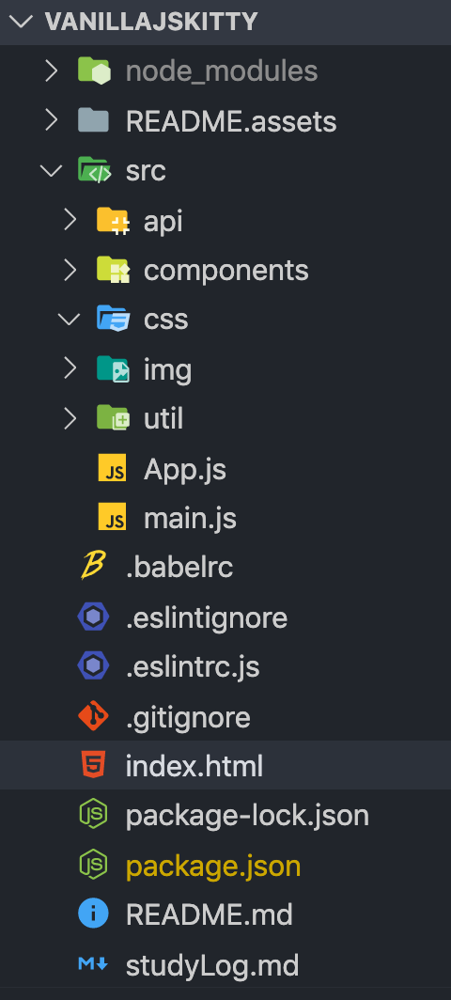

<h1 align="center">vanillaJSKitty 🐱</h1>
<p align="center">프로그래머스 2020 Dev-Matching: 웹 프론트엔드 개발자 (상반기) 과제<br/> Vanilla JS 고양이 사진 검색기</p>
<p align="center"><a href="https://vanilajskitty.web.app">데모 페이지</a></p>


이 레포는 **[프로그래머스 2020 Dev-Matching: 웹 프론트엔드 개발자 (상반기)](https://programmers.co.kr/competitions/131/2020-web-fe-first)** 과제를 복기한 결과물입니다.

라이브러리/프레임워크 없이 Vanilla JS로 고양이 사진을 검색하는 애플리케이션을 구현한 과정과, 해당 과정에서 필요한 지식들을 정리했습니다.

과제의 상세 요구조건들은 아래 출처에서 참고해 복기하였습니다.

- [프로그래머스 2020 Dev-Matching : 웹 프론트엔드 과제 복기](https://velog.io/@hyeon930/series/프로그래머스-2020-Dev-Matching-웹-프론트엔드-과제-복기)

- [프로그래머스 웹 프론트엔드 데브 매칭 후기](https://imch.dev/posts/2020-programmers-web-frontend-dev-matching/)

- [프로그래머스 2020 Dev-Matching 웹 프론트엔드 개발자(상반기) 후기](https://taeny.dev/essay/%ED%94%84%EB%A1%9C%EA%B7%B8%EB%9E%98%EB%A8%B8%EC%8A%A4-2020-dev-matching-%EC%9B%B9-%ED%94%84%EB%A1%A0%ED%8A%B8%EC%97%94%EB%93%9C-%EA%B0%9C%EB%B0%9C%EC%9E%90(%EC%83%81%EB%B0%98%EA%B8%B0)-%ED%9B%84%EA%B8%B0/)

## install


```shell
npm install # 필요한 dependency를 설치합니다.
```


## 구현 과정


---

## 1. 프로젝트 설정

### 바벨(BabelJS) 설정

프로그래머스 과제에서 기본적으로 주어진 babel 설정을 그대로 설치함.

`npm i -D @babel/cli @babel/core @babel/preset-env @babel/polyfill`

#### 바벨이란? [참고 링크](https://www.zerocho.com/category/ECMAScript/post/57a830cfa1d6971500059d5a)

ES2015+ 문법을 사용한 코드를 예전 ES5 자바스크립트 코드로 바꿔주는 도구들. 바벨 7부턴 모든 바벨 패키지들이 `@babel` 이라는 네임스페이스 안에 속하게 되었음.

#### 바벨 설정파일 .babelrc

바벨 설정파일 `.babelrc` 을 통해 preset이나 plugin을 연결할 수 있다. preset은 여러 플러그인의 모음집이다. 다양한 preset 들이 있는데, 그 중 **env** 프리셋은 타겟 브라우저를 입력하면 알아서 사용자가 환경에 맞춰 최신 EcmaScript를 사용할 수 있게 해준다.

`.babelrc`

```js
{
  "presets": [
    ["@babel/preset-env", { "targets": { "browsers": ["last 2 versions", ">= 5% in KR"] } }]
  ]
}
```

#### package.json 스크립트 설정

```js
"scripts": {
  "build": "babel src -d dist -w",
}
```

위와 같이 설정하면, `npm run build` 명령을 수행할 때 babel을 실행하고, src 폴더에 있는 JS 코드를 컴파일하여 그 결과를 dist 폴더에 저장하라는 것.

`-d` : dist라는 디렉토리를 생성하고 그 안에 js를 컴파일해서 같은 이름으로 넣어준다.
`-w` : watch의 줄임말로 코드가 바뀔때마다 알아서 컴파일해서 즉각적으로 실행을 가능하게 해줌.

### ESLint 설정 [참고 링크](https://www.daleseo.com/js-eslint/)

`node_modules/.bin/eslint --init`  명령어로 자동으로 `.eslintrc.js` 파일을 만들 수 있다.

#### package.json 스크립트 설정

```js
"scripts": {
  "lint": "eslint src/**/*.js",
}
```

src 경로에 있는 모든 js 파일을 ESLint의 대상으로 간주하는 스크립트다.

#### .eslintignore

```js
node_modules
```

gitignore과 비슷하게 lint 검사에 제외할 디렉토리를 명시할 수 있다.

---

## 2. 디렉토리 설정

디렉토리 설정은 아래와 같다. React와 상당히 유사하다.



`index.html`

```html
<!DOCTYPE html>
<html lang="en">
    <head>
        <meta charset="UTF-8" />
        <meta name="viewport" content="width=device-width, initial-scale=1.0" />
        <meta http-equiv="X-UA-Compatible" content="ie=edge" />
        <title>Vanilla JS Kittysearch</title>
        <script type="module" src="./src/main.js"></script>
    </head>
    <body></body>
</html>
```

`index.html` 파일 자체는 오직 script만을 불러오고, 다른 역할은 수행하지 않는다.


### 자바스크립트의 모듈 시스템

참고 링크1 : [의존성 관리](https://ui.toast.com/fe-guide/ko_DEPENDENCY-MANAGE/)
참고 링크2 : [You don't know JS module](https://ui.toast.com/weekly-pick/ko_20190418/)

모듈 스코프는 전역과 분리된 모듈만의 독립된 스코프이다. 모듈 스코프에 선언된 변수나 함수는 외부에서 접근할 수 없고, 별도로 `export`한 변수와 함수만 외부에서 접근할 수 있다. 위의 `index.html` 에 작성한 것처럼 모듈은 `script` 태그에 `module` 타입을 설정하여 로드할 수 있다.

```js
<script type="module" src="./src/main.js"></script>
```

외부에 노출시킬 함수와 변수를 지정할 수 있기 때문에, 모듈 스코프를 사용하면 전역 스코프가 여러 변수로 오염되는 것을 막을 수 있다. 또, 코드 상에서 명시적으로 모듈을 가져오기 때문에 코드로 모듈간 의존성을 파악할 수 있다.

#### 모듈 시스템 사용법

모듈 스코프를 사용하기 위해선 **ES6의 모듈**을 사용해야 한다. 모듈이 표준으로 정의된 ES6이 나오기 전에는 CommonJS와 AMD에서 제안하는 모듈 정의 방법이 있었다. 각각의 모듈 정의 방법은 아래와 같다. (현재 활발히 사용되고 있는 모듈은 ES6 모듈과 CommonJS 모듈 2가지이다)

#### AMD (Asynchronous Module Definition)

비동기 방식으로 `define` 함수를 사용하여 모듈의 API와 의존성 관계를 정의한다. CommonJS 보다는 문법이 덜 직관적이다.

```js
define(['jquery', 'lodash'], function($, _) {
  function privateFn() {};
  function publicFn() {};

  return {
    publicFn: publicFn
  };
});
```

AMD는 브라우저에서 바로 사용 가능하고, AMD를 지원하는 대표적인 라이브러리는 `RequireJS` 이다. 

#### CommonJS

동기 방식으로, **require** 함수로 의존성 모듈을 가져오고 **module.exports 객체**로 모듈의 API를 정의한다. 

CommonJS는 JS를 브라우저 이외의 환경에서 사용하고자 만들어졌기 때문에, 브라우저에서 바로 사용할 수 없다. 브라우저에서 CommonJS로 작성한 JS를 실행하려면 번들러로 변환과정을 거쳐야 한다. 하지만 Node에서는 CommonJS를 바로 사용할 수 있다.

**CommonJS 모듈의 내보내기**

`module.exports` 객체를 조작해서 모듈을 내보낼 수 있다.

1. module.exports 객체의 프로퍼티로 추가하여 내보내기

```js
module.exports.crop = function() {};
module.exports.rotate = function() {};
```

2. `module.export` 객체를 치환해서 내보내기

```js
module.exports = {
  crop: function() {},
  rotate: function() {}
}
```

**CommonJS 모듈의 가져오기**

`require()` 함수의 반환 값을 사용해 모듈을 가져올 수 있다. 이렇게 가져온 모듈은 앞서 내보낸 `module.export` 객체를 받은 것처럼 동작한다.

```js
let filter = require('filter')

filter.crop()
filter.rotate()
```

#### UMD (Universial Module Definition)

다양한 모듈 방식을 모두 지원하는 일종의 코드 패턴으로, 조건문으로 AMD나 CommonJS를 지원하는지 확인하여 지원하는 모듈 방식의 코드를 사용할 수 있다. 직접 UMD를 작성하는 일은 드물며 대부분 번들러에 의해 생성되는 코드를 사용한다.

#### ES6 모듈 ⭐️

ES6에서 표준으로 정의된 모듈에서는 모듈 정의를 위해 **export** 와 **import** 키워드를 사용한다.

**ES6 모듈의 내보내기**

CommonJS 모듈과 다르게 2가지 방법으로 내보낼 수 있다.

1. 이름 붙인 내보내기 (named export)
2. 기본값 내보내기

- **이름 붙인 내보내기 (named export)** - 함수, 변수, 클래스를 개별로 여러개 export 할 수 있다.

  ```js
  // filter.js
  // export 키워드를 사용해 개별로 export
  export function crop() {};
  export const rotate = function() {};
  ```
  

named export 한 모듈을 import 할 때는 `import` 키워드와 중괄호 `{}` 를 사용하고, 반드시 `export` 문에서 정의한 모듈 이름으로 가져와야 한다.

```js
  // graphics.js
  import {crop, rotate} from './filter';
  crop();
  rotate();
```

  named export의 경우 모듈을 import 할 때 **as 키워드로 별칭**을 붙일 수 있다.

  ```js
  // index.js
  import {sayHello as hi} from './lib';
  hi(); // Hello
  ```

- **기본값 내보내기** 

  내보내는 객체에 이름을 정의하지 않고, 한 모듈 파일 당 한 번만 사용할 수 있다. 모듈을 `default export` 로 지정할 경우, import 할 때 중괄호 `{}` 를 사용하지 않아도 된다.

  ```js
  // lib.js
  export default function sayHello(){
    console.log("Hello");
  }
  ```

  ```js
  // index.js
  import sayHello from './lib';
  sayHello(); // Hello
  ```

**ES6 모듈의 가져오기**

`import` 와 `from` 으로 모듈을 가져온다.

-  모듈 전체를 import 할 때는 `*` 을 사용한다.

  ```js
  // index.js
  import * as lib from './lib';
  lib.sayHello(); // Hello
  ```


- named export 한 모듈을 가져올 때는 `{}` 를 사용한다. default export 한 모듈을 가져올 때는 중괄호 없이 그냥 이름을 사용한다.

  ```js
  import {add, average} from 'mathmatics'
  import TextBox from 'textBox'
  ```


#### 근데... 대체 왜 모듈 시스템이 여러개인거야? 😒

ES6이 배포되기 전에는 ECMAScript에 **모듈이라는 개념**이 존재하지 않았고, 규모가 큰 프로젝트에서 의존성을 관리하기가 매우 불편했다. 따라서 모듈 간 의존성을 관리하기 위해 표준은 아니지만, **AMD나 CommonJS 같은 여러 모듈 방식**이 만들어졌다. 이 방식들을 토대로 여러 파일들을 한 개 또는 몇 개의 파일로 합쳐주는 requireJS, Browserify, Webpack등의 **번들러**가 개발되었다.

한동안 사람들은 이런 번들러들을 통해 모듈 개발을 계속했고, 이런 모듈 개발이 방식이 널리 퍼졌다. 하지만 2015년에 ES6가 등장하며 모듈 개념이 정식으로 ECMAScript 명세에 수록되었다. ES6을 지원하는 환경이 많지 않을 당시, **Babel**이 등장해 ES6 을 ES5 코드로, ES6 모듈을 CommonJS로 트랜스파일 해주면서 표준인 ES 모듈 개발 환경이 기존의 모듈 방식들을 대체할 수 있었다. 그 당시 **Webpack1** 은 풍부한 plugin을 통해 번들러 기능 외에 Task Runner 등의 다양한 기능들도 수행할 수 있어서 많이 사용되고 있었는데, ES6 문법을 처리하지 못하고 Babel을 이용해 CommonJS 모듈 형태로 변환된 코드만 번들링 할 수 있었으므로 Babel loader + Webpack을 쓰는 패턴이 많이 사용되었다.

지금까지 Webpack1로 개발된 라이브러리들이 잘 동작하고 있고, 최근의 프로젝트들 역시 ES6 모듈을 사용하더라도 필요에 따라 CommonJS 모듈 방식으로 내보내진 모듈을 사용하기도 하므로 여러 모듈 방식의 코드들이 웹 프론트엔드 생태계에 공존하게 되었다.

---

## 3. API 설정

API는 [The CAT API](https://thecatapi.com/) 를 사용할 것입니다. 🐱

### 비동기 처리 - Callback, Promise, Async/Await

참고 링크1 : [[자바스크립트] 비동기 처리 1부 - Callback](https://www.daleseo.com/js-async-callback/)
참고 링크2: [[자바스크립트] 비동기 처리 2부 - Promise](https://www.daleseo.com/js-async-promise/)
참고 링크3: [[자바스크립트] 비동기 처리 3부 - async/await](https://www.daleseo.com/js-async-async-await/)

#### Callback vs Promise

Promise는 현재에는 당장 얻을 수는 없지만 가까운 미래에는 얻을 수 있는 어떤 데이터에 접근하기 위한 방법을 제공한다. 당장 얻을 수 없다는 의미는 데이터를 얻기 위해 지연이 발생하는 경우를 말하는데, 이는 I/O 나 network를 통해서 데이터를 얻는 경우에 해당한다.

이런 지연이 발생하는 경우는 CPU 입장에서 엄청나게 긴 시간이기 때문에, Non-blocking 코드를 지향하는 JS에서는 비동기 처리가 필수적이다.

`콜백 함수 비동기 처리 방식`

```js
// getUser은 두번째 인자로 결과값을 이용해 실행될 로직을 넘겼고, 비동기 함수인 setTimeout 함수는 1초 후에 이 콜백함수를 호출했다.
function getUser(id, callback) {
  setTimeout(function () {
    console.log("Getting ID...")
    const user = {
      id: id,
      name: "User" + id,
      email: id +"@test.com",
    }
    callback(user)
  }, 1000)
}

getUser(1, function(user) {
  // 결과값을 이용해 실행될 로직
  console.log("user:", user)
})
```

이와 같이 콜백 함수를 이용해 비동기 처리를 해줄 때는, 비동기 함수로부터 결과값을 바로 리턴 받으려고 하지말고, 결과값을 통해 처리할 로직을 콜백 함수로 넘기는 스타일로 코딩을 해줘야 예상된 결과를 얻을 수 있다.

`Promise 이용한 비동기 처리 방식`

```js
function getUser(id) {
  // Promise 객체를 생성해 리턴한다
  return new Promise(function (resolve) {
    setTimeout(function () {
      console.log("Getting ID...")
      const user = {
        id: id,
        name: "User" + id,
        email: id +"@test.com",
      }
      resolve(user)
    }, 1000)
  })
}

getUser(1).then(function (user) {
  console.log("user:", user)
})
```

콜백함수를 인자로 넘기는 대신, Promise 객체를 생성해 리턴했고, 호출할 때는 리턴받은 Promise 객체에 `then()` 메서드를 호출하여 결과값을 가지고 실행할 로직을 넘겨준다.

콜백 함수와의 가장 큰 차이점은, 함수를 호출하면 `Promise` 타입의 결과값이 리턴되고 이 결과값을 가지고 다음 로직을 수행한다는 것!

비동기 처리 코드임에도 불구하고 마치 동기처럼 코드가 읽히기에 조금 더 직관적이다.

#### Promise 사용 방법

실제 코딩을 할 때는 Promise를 직접 생성해서 리턴해주는 코드를 작성하기보다는, 어떤 라이브러리의 함수를 호출해서 리턴 받은 Promise 객체를 사용하는 경우가 더 많다.

대표적으로 REST API를 호출할 때 사용되는 브라우저 내장 함수 `fetch()` 가 있다. `fetch()` 함수는 API의 URL을 인자로 받아, 미래 시점에 얻게 될 API 호출 결과를 Promise 객체로 리턴한다.

Promise 객체의 **then()** 메소드는 결과값을 가지고 수행할 로직을 담을 콜백 함수를 인자로 받고, **catch()** 메서드는 예외 처리 로직을 담은 콜백 함수를 인자로 받는다.

```js
fetch("https://api.thecatapi.com/v1/breeds/search?limit=50").then((response) => {
  if(response.status === 200) {
    return response.json()
  } else {
    console.log(response.statusText);
  }
}).then(returnedData => {
  console.log(returnedData)
}).catch(err => {
  console.log(err)
})
```

#### 참고 - XMLHttpRequest vs Fetch [참고 링크](https://junhobaik.github.io/ajax-xhr-fetch/)

기존 AJAX의 대표적인 API는 XMLHttpRequest 였다. ES2015 표준으로 Fetch API가 등장하면서 이제는 일반적으로 Fetch API를 통해 AJAX를 구현하게 되었다.

#### Async/Await

기존 Fetch API를 사용해 작성한 코드는 아래와 같다.
Method Chaining 기법을 통해 `then()` 메서드를 호출한다.

```js
const API_ENDPOINT = "https://api.thecatapi.com/v1";

const api = {
    fetchAllImage: () => {
        return fetch(`${API_ENDPOINT}/images/search?limit=10`).then(res => res.json());
    },
};

export default api;
```

Promise는 디버깅, 예외 처리 (try/catch 대신 catch메서드 사용), 들여쓰기로 인한 가독성 하락 등의 문제가 있다. 이를 해결하기 위해 ES7에 나온 키워드가 바로 `async/await`.

이를 async await 을 사용해 코드를 변경하면 아래와 같다.

```js
const api = {
    fetchAllImage: async () => {
      	const res = await fetch(`${API_ENDPOINT}/images/search?limit=10`)
        return res.json());
    },
};
```

**await** 키워드는 **async** 키워드가 붙어있는 함수 내부에서만 사용할 수 있으며, 비동기 함수가 리턴하는 Promise 로부터 결과값을 추출해준다. 

await 키워드를 사용하면 비동기 코드의 결과 값을 얻을 수 있을 때까지 기다리기 때문에, 일반적인 동기코드와 동일한 흐름으로 (함수 호출 후 결과값을 변수에 할당하는 식으로) 코드를 작성할 수 있어서 편리하다.

또한 동기/비동기 구분 없이 try/catch로 일관되게 예외 처리를 할 수 있다.

#### async await 사용 시 주의해야 할 점

**async** 키워드가 붙어있는 함수를 호출하면 명시적으로 Promise 객체를 생성하여 리턴하지 않아도 **Promise 객체가 리턴**된다. 이 객체가 최종적으로 반환하는 결과값을 사용할 땐 `then()` 메서드를 이용해야하는것!

하지만 만약 async 함수를 호출하는 함수 역시 async 함수 내부에 있다면, 동일한 방식으로 await 키워드를 통해 Promise가 제공하는 값에 바로 접근할 수 있다.

---

## 4. Lazy Loading 구현

[heropy 블로그 출처](https://heropy.blog/2019/10/27/intersection-observer/), [상세한 예제](https://tech.lezhin.com/2017/07/13/intersectionobserver-overview), [간단 정리]([https://medium.com/@pks2974/intersection-observer-%EA%B0%84%EB%8B%A8-%EC%A0%95%EB%A6%AC%ED%95%98%EA%B8%B0-fc24789799a3](https://medium.com/@pks2974/intersection-observer-간단-정리하기-fc24789799a3))

### intersection observer 이란?

Intersection observer은 브라우저 뷰포트와 설정한 요소의 교차점을 관찰한다. 이 요소가 사용자 화면에 보이는 요소인지 아닌지를 구별하는 기능을 제공한다.

비동기적으로 실행되기 때문에 scroll 같은 이벤트 기반 요소 관찰에서 발견되는 렌더링 성능이나, 이벤트 연속 호출의 문제 없이 사용할 수 있다.

### intersection observer 구조

`new IntersectionObserver()` 을  통해 생성한 인스턴스로 **관찰자를 초기화**하고, **관찰할 대상을 지정**한다.

```js
const io = new IntersectionObserver (callback, options); // 관찰자 초기화
io.observe(element) // 관찰할 대상 지정
```
```js
const io = new IntersectionObserver((entries, observer) => {
  entries.forEach(entry => {
    console.log(entry)
  })
}, options)
io.observe(element)
```
- **callback** : 관찰할 대상이 등록되거나, 가시성에 변화가 생기면 관찰자는 callback을 실행함. callback은 2개의 parameters를 가진다.
  1. `entries` : IntersectionObserverEntry 인스턴스의 배열로, IntersectionObserverEntry는 아래와 같은 속성들을 포함한다.
     - `boundingClientRect`: 관찰 대상의 사각형 정보([DOMRectReadOnly](https://developer.mozilla.org/en-US/docs/Web/API/DOMRectReadOnly))
     - `intersectionRect`: 관찰 대상의 교차한 영역 정보([DOMRectReadOnly](https://developer.mozilla.org/en-US/docs/Web/API/DOMRectReadOnly))
     - `intersectionRatio`: 관찰 대상의 교차한 영역 백분율(`intersectionRect` 영역에서 `boundingClientRect` 영역까지 비율, Number)
     - `isIntersecting`: 관찰 대상의 교차 상태(Boolean)
     - `rootBounds`: 지정한 루트 요소의 사각형 정보([DOMRectReadOnly](https://developer.mozilla.org/en-US/docs/Web/API/DOMRectReadOnly))
     - `target`: 관찰 대상 요소([Element](https://developer.mozilla.org/en-US/docs/Web/API/Element))
     - `time`: 변경이 발생한 시간 정보([DOMHighResTimeStamp](https://developer.mozilla.org/en-US/docs/Web/API/DOMHighResTimeStamp))
  2. `observer` : 콜백이 실행되는 해당 IntersectionObserver 인스턴스를 참조한다 

- **options** : root, rootMargin, threshold 에 대한 설정을 할 수 있다.

  - root: 타겟의 가시성을 검사하기 위해 뷰포트 대신 사용할 요소 객체를 지정할 수 있다. 타겟의 조상 요소여야 하며, 지정하지 않을 경우 브라우저 뷰포트가 기본 사용된다.

    ```js
    const io = new IntersectionObserver(callback, {
      root: document.getElementById("my-viewport")
    })
    ```

  - rootMargin: margin을 활용해 root 범위를 확장하거나 축소할 수 있다. css의 margin 설정과 동일하며 단위를 꼭 입력해야한다. (px 또는 %)

  - threshold: 옵저버가 실행되기 위해 타겟의 가시성이 얼마나 필요한지 백분율로 표시한다. 기본 값은 [0] 이지만 Number 타입의 단일 값으로도 작성이 가능하다.

    - 0 : 타겟의 가장자리 픽셀이 Root 범위를 교차하는 순간 (보이기 시작할 때) 옵저버가 실행된다.
    - 0.3 : 타겟의 가시성이 30%일 때 옵저버가 실행된다.
    - [0,0.3,1] : 타겟의 가시성이 0%, 30%, 100%일때 모두 옵저버가 실행된다

### intersection observer 의 메서드

#### observe

대상 요소의 관찰을 시작한다.

```js
const io1 = new IntersectionObserver(callback, options)
const io2 = new IntersectionObserver(callback, options)

const div = document.querySelector('div')
const li = document.querySelector('li')
const h2 = document.querySelector('h2')

io1.observe(div) // DIV 요소 관찰
io2.observe(li) // LI 요소 관찰
io2.observe(h2) // h2 요소 관찰
```

#### unobserve()

대상 요소의 관찰을 중지한다. 

```js
io1.unobserve(div) // DIV 요소 관찰
```

콜백의 두 번째 인수 observer가 해당 IntersectionObserver를 참조하므로, 아래와 같이 작성할 수도 있다.

```js
const io = now IntersectionObserver((entries, observer) => {
  entries.forEach(entry -> {
    // 가시성의 변화가 있으면 관찰 대상 전체에 대한 콜백이 실행되므로, 관찰대상의 교차 상태가 false일 경우엔 실행하지 않음.
    if (!entry.isIntersecting){
      return
    }
    // 관찰 대상의 교차 상태가 true일 경우 실행할 코드들
    // ...
    
    // 위 실행을 처리하고 (1회) 관찰 중지
    observer.unobserve(entry.target)
  })
})
```

### 간단한 예제

```js
// 타겟의 가시성이 100%일 때 옵저버 실행
const options = {threshold: 1.0}
const callback = (entries, observer) => {
  entries.forEach((entry) => {
    if (entry.isIntersecting) {
      observer.unobserve(entry.target);
      console.log("화면에서 노출됨");
    } else {
      console.log('화면에서 제외됨')
    }
  });
}
const observer = new IntersectionObserver(callback, options); // IntersectionObserver 인스턴스 생성
observer.observe(document.getElementById('id')) // 타겟 요소 추가
```

1. IntersectionObserver 객체의 인스턴스 (이 예제에서는 observer) 를 생성하면서, callback 함수와 option을 전달한다.
2. IntersectionObserver 에서 observe할 타겟 요소 (document.getElementById) 를 추가한다.
3. 타겟 요소가 options에서 정의한 percent 만큼 화면에 노출 혹은 제외되면 **entries 배열에 추가**하고, **callback 함수를 호출**한다.
4. callback 함수에서 전달 받은 entries 배열을 확인하면서, isIntersecting으로 가시성 여부를 확인한다.
5. 더 이상 Target element를 구독할 필요가 없다면, unobserve로 제거할 수 있다.

### Lazy Loading 사용 예시

img의 `src` 속성에는 페이지가 처음 로드되었을 때 나타나는 placeholder 이미지가 들어가고,
`data-src` 혹은 `data-srcset` 속성에는 타겟 요소가 가시화되었을 때 로드할 이미지가 들어간다.

`html 마크업 예시`

```html


```

`js 예시`

```js
const options = {threshold: 0};
const callback = (entries, observer) =>{
  entries.forEach((entry) => {
    if (entry.isIntersecting) {
      observer.unobserve(entry.target);
      entry.target.src = entry.target.dataset.src;
    }
  })
}
const io = new IntersectionObserver(callback,options);
io.observe(Array.from(document.getElementsByClassName('lazy')))
```

1. lazy className으로 등록된 element들을 모두 IntersectionObserver 구독에 추가한다.
2. target 요소가 노출이 될 때마다, entry의 target을 가져와 src를 dataset.src 값으로 설정한 뒤 구독에서 제외한다.

### 구현한 Lazy loading 코드

`DOM element 만들기`

```js
const cardImage = document.createElement("img");
cardImage.className = "card-image";
cardImage.classList.add("lazy");
cardImage.dataset.src = url;
```

`Intersection observer 만들기` 

```js
// ResultSection.js
initiateObserver() {
  const options = { threshold: 0 };
  const callback = (entries, observer) => {
    entries.forEach((entry) => {
      if (entry.isIntersecting) {
        observer.unobserve(entry.target);
        entry.target.src = entry.target.dataset.src;
      }
    });
  };
  const io = new IntersectionObserver(callback, options);
  const lazyImages = Array.from(document.getElementsByClassName("lazy"));
  lazyImages.forEach((image) => {
    io.observe(image);
  });
}
```

`ResultSection.js`

```js
constructor($target, data) {
  this.section = document.createElement("section");
  this.section.className = "result-section";
  this.data = data;
  $target.appendChild(this.section);
  this.render();
  this.initiateObserver();
}

setState(data) {
  this.data = data;
  this.render();
  this.initiateObserver(); // render 이후에 실행해줌
}
```

---

## 5. Scroll Pagining 구현

역시 intersection observer 활용해서 구현했다.

----

## 6. 다크 모드 구현

### prefers-color-scheme

`prefers-color-scheme` 으로 OS의 라이트 모드/다크 모드를 인식하고 이에 맞는 CSS를 적용할 수 있다. [출처](https://studiomeal.com/archives/1053)

```css
/* only light mode */
@media (prefers-color-scheme: light) {
  .dark {
    display: none;
  }
}

/* only dark mode */
@media (prefers-color-scheme: dark) {
  body {
    color: lightgray;
    background: black;
  }
  .light {
    display: none;
  }
}
```

### 사용자 임의 설정

사용자에게 임의로 다크 모드, 라이트 모드를 선택하게 하기위해서 localStorage에 변수 값을 저장해 활용할 수 있다.

또한, body에 `.dark` , `.light` 속성을 toggle 하는 식으로 사용자가 모드를 임의 설정하도록 할 수 있다.